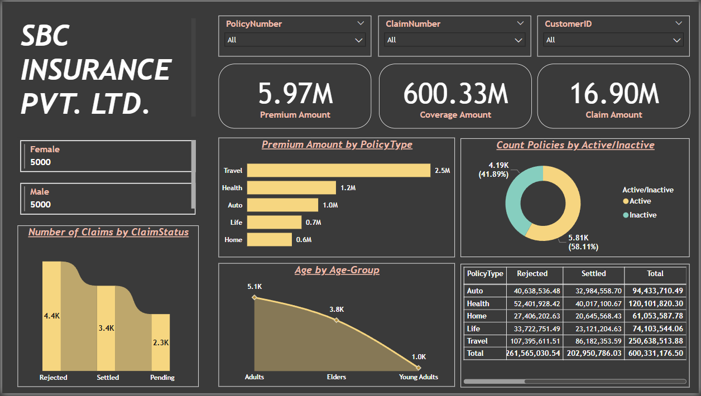

# Insurance Data Analysis (Power BI)

## 📊 Project Overview
This project analyzes 10,000 rows of insurance policy data for a fictional company — **SBC Insurance Pvt. Ltd.**  
The dashboard provides insights into policy status, claim outcomes, age group distributions, and premium trends.  
A secondary page includes a pivot-style drill-down view for deeper exploration by policy type.

---

## 📁 Dataset Overview

- **Records**: 10,000 unique rows
- **Features**:
  - CustomerID, PolicyNumber, Gender, Age, AgeGroup
  - PolicyType, PolicyStartDate, PolicyEndDate
  - PremiumAmount, CoverageAmount
  - ClaimNumber, ClaimDate, ClaimAmount, ClaimStatus
  - Policy Status: Active / Inactive

---

## 🛠 Tools & Technologies Used
- Power BI Desktop (.pbix)
- Microsoft SQL Server (data source)
- Power Query for data cleaning
- DAX for calculated columns
- Power BI Service (planned deployment)

---

## 📈 Visuals Included

### 📄 Page 1 (Dashboard)
- **KPI Cards**: Total Premium, Coverage, and Claim Amounts
- **Donut Chart**: Policy Active vs Inactive
- **Stacked Bar Chart**: Premium by Policy Type
- **Line Chart**: Age Group Distribution
- **Ribbon Chart**: Number of Claims by Status
- **Matrix**: ClaimStatus vs PolicyType (by Coverage)
- **Multi-Row Cards**: Gender-wise summary
- **Slicers**: Policy Number, Claim Number, Customer ID

### 📊 Page 2 (Coming Soon)

---

## 🧹 Data Cleaning & Transformation Highlights

- Removed duplicate values
- Standardized dates:
  - `ClaimDate` transformed from `MM-DD-YYYY` to `DD/MM/YYYY`
  - Used `Date.FromText()` + `Text.Middle()` methods
- Converted `"NULL"` text to actual `null` values to resolve type errors
- Added conditional columns:
  - **AgeGroup**: `"Young Adults"`, `"Adults"`, `"Elders"`
  - **Policy Status**: `"Active"` / `"Inactive"`
- Verified all column data types and formats for consistency

---

## 📌 Key Insights

- 👵 **Adults (24–60 years)** are the dominant policyholders
- ❌ Most claims were **rejected**
- ✅ 58.11% of policies are currently **active**
- 🧳 **Travel** policies have the **highest premiums**, **Home** the least
- ⚖️ No apparent **gender bias** in claims or premium distributions

---

## 🖼️ Dashboard Preview

### Page 1: Insurance Dashboard

---

## 🚧 Status
🟡 **In Progress**

### ✅ Completed:
- Data imported via MS SQL Server
- Cleaning, transformation, and dashboard creation done

## 🔜 Upcoming 🔄 Planned Power BI Service Features
- **Publishing**: The dashboard will be hosted on Power BI Service for cloud accessibility
- **Scheduled Refresh**: Automated refresh configured to sync live data from MS SQL Server
- **Security**: Row-Level Security (RLS) will be used to restrict data visibility based on user roles

---

